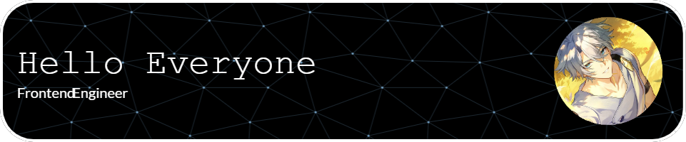

# Hello World! I'm Zahrah Hafizah Fakhri 👋🏻

---

## About Me

- 🎓 Informatics | ✨ Aspiring **Frontend Engineer**
- 🏫 University of Bengkulu, Bengkulu
- 🔭 Currently building **modern web interfaces** using React.js
- 📖 Learning **Storybook** for UI component-driven development
- 💡 Passionate about clean UI, scable frontend architecture, and usability
- 🔍 Exploring the MERN Stack, with a focus on frontend
- 💭 Ask me about anything related to **Javascript**, **React**, or **Frontend Dev**

---

---

## 💻 Tech Stack Overview

#### Skills on Point

#### Framework on Point

---

<!-- The last person standing is the winner. If you want to be the last one standing, be strong. -- Kageyama Tobio -->
